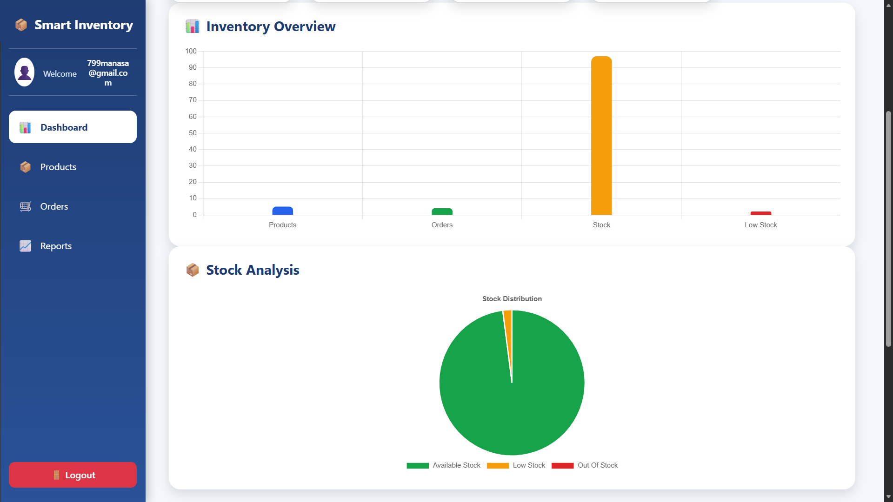
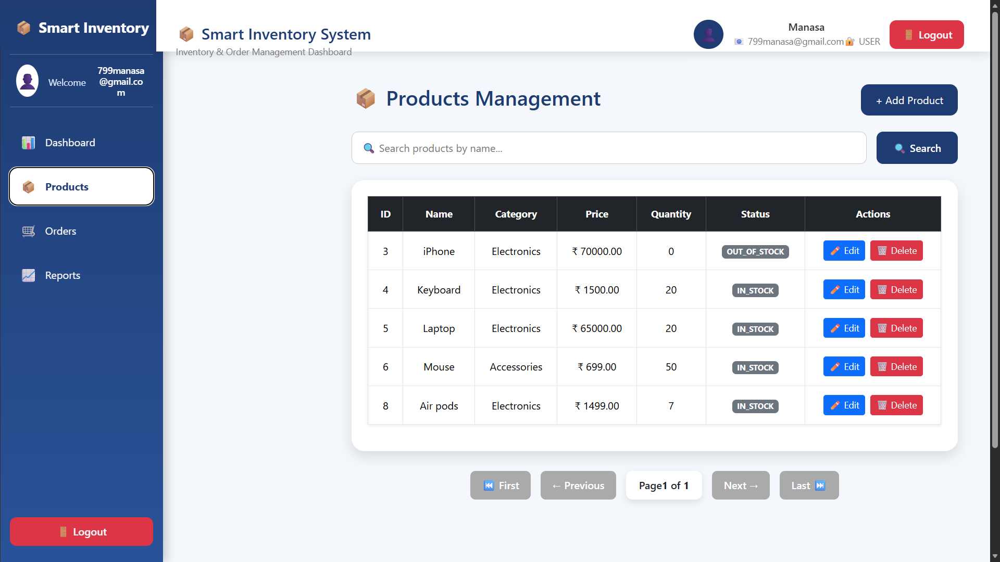
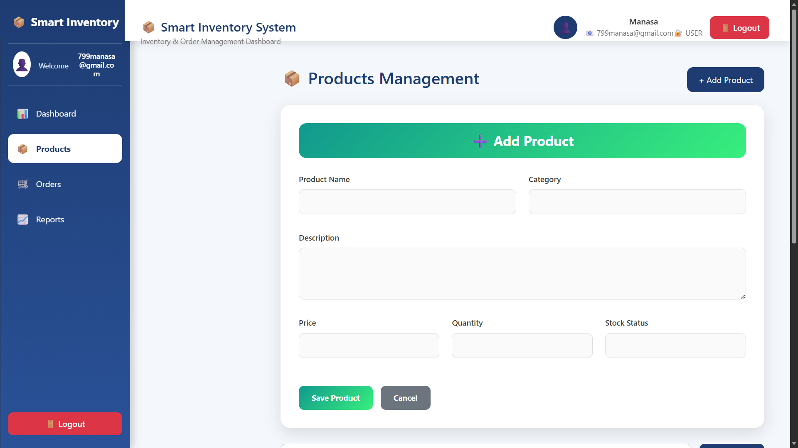
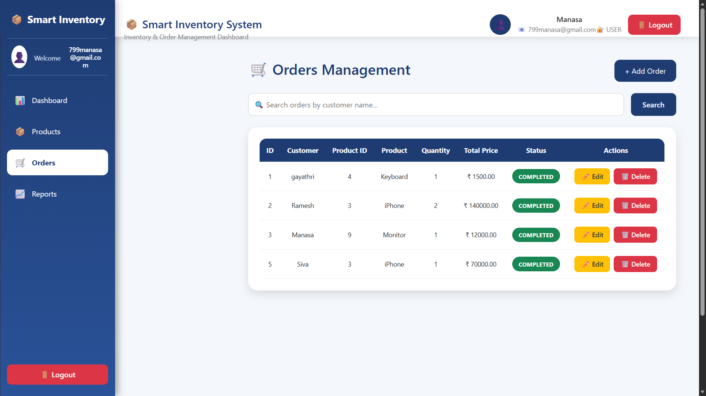
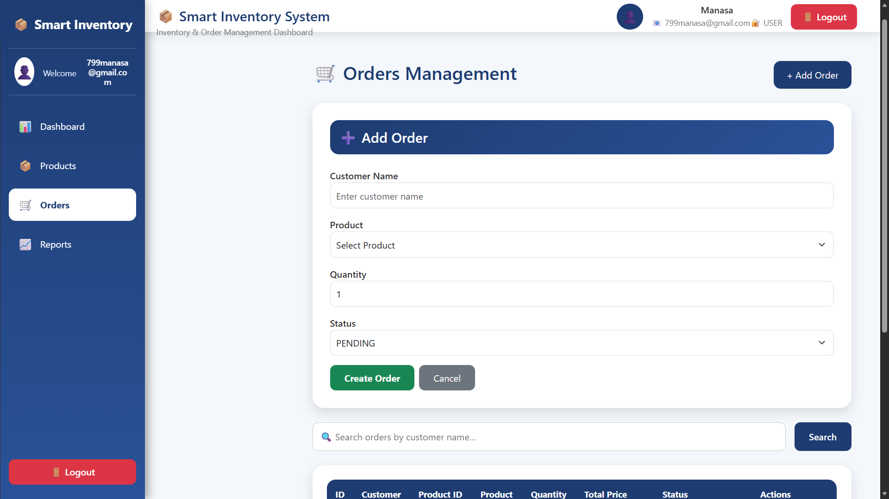

# 📦 Smart Inventory & Order Management System

A Full Stack Web Application developed using **Spring Boot**, **React**, **MySQL**, and **JWT Authentication** to efficiently manage inventory and customer orders.

---

# 🚀 Features

## Authentication
- User Registration
- User Login
- JWT Authentication
- Secure Routes
- Logout

## Dashboard
- Dashboard Overview
- Product Statistics
- Order Statistics
- Low Stock Information

## Product Management
- Add Product
- Update Product
- Delete Product
- Search Products
- Pagination
- Automatic Stock Status

## Order Management
- Create Order
- Update Order
- Delete Order
- Search Orders
- Pagination
- Automatic Stock Update

---

# 🛠 Tech Stack

## Frontend
- React.js
- Bootstrap
- Axios
- React Router
- React Toastify

## Backend
- Spring Boot
- Spring Security
- JWT
- Spring Data JPA

## Database
- MySQL

---

# 💻 Tools

- IntelliJ IDEA
- VS Code
- MySQL Workbench
- Postman
- Git
- GitHub

---

# 📷 Screenshots

## Login


---

## Dashboard Overview



---

## Dashboard Products


---

## Dashboard Orders


---

## Products



---

## Add Product



---

## Orders



---

## Add Order



---

## Product Search


---

## Order Search


---

# 📂 Project Structure

```
smart-inventory-order-management/
│
├── backend/
├── frontend/
├── screenshots/
└── README.md
```

---

# 👨‍💻 Author

**Manasa Munagala**

B.Tech CSE Student

Full Stack Java Developer